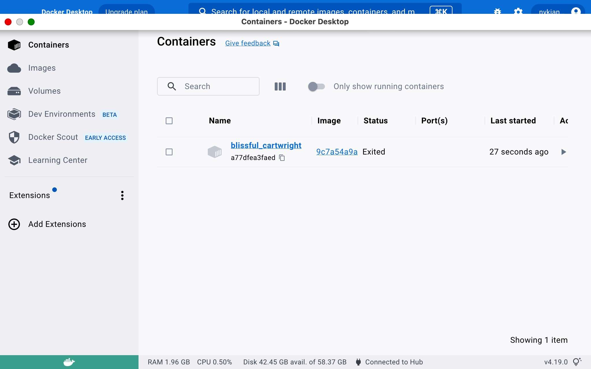

---  
type: TutorialClass  
title: 0.4-Docker-CLI  
description: In this Section, we will explore the Docker CLI. You will learn to  
  pull images from the DockerHub as well as build them with the use of a  
  Dockerfile. You will also learn how to run and start containers from the  
  command line. The Docker CLI is very robust but you will become an expert  
  simply through repetition, I promise!  
share: true  
category: 0-Getting-Started  
created: Friday, June 9th 2023, 12:11:57 am  
modified: Sunday, June 11th 2023, 1:51:50 pm  
tags:  
  - shapecreations  
  - docker  
  - containers  
  - images  
  - cli  
  - module-0  
media: '["!(Tutorial/media/official-image-badge-iso.png)","!(Tutorial/media/docker-desktop-image-view.jpeg)",  
  "!(Tutorial/media/docker-desktop-container-view.jpeg)","!(docker-desktop-image-layer-view.png)"]'  
status: in-progress  
---  
  
  
[←Link to Previous Tutorial](./0.3-Docker-Primer.md#)  
  
---  
  
# 0.4-Docker-CLI  
  
  
  
---  
  
## Overview  
  
We will now get to brass tax and start working with our newly installed Docker Engine. This section will continue to expand on our Docker knowledge-base with a few more necessary concepts and tools that will make our lives a whole lot easier. But as is usually the way, we must push through the tedious method before we can appreciate the *shortcuts*.  
  
> ⚠ Warning!    
> Do not skip through this section. This Section, more than any of its predecessors, will be interlaced with tips and caveats, without which you will almost certainly have difficulty when we start developing Shape Creations.  
>  
> Docker is not perfect but it is a machine. In all its complexity, it has a simple set of underlying rules that govern its behavior. If you learn the rules, you can better manipulate it to achieve your goals. But enough serious talk though, let’s get to it!  
  
## Forget Something?  
  
As we start to pile on the Docker CLI commands, you may experience a harmless case of Docker amnesia. The Docker CLI has an extensive web of commands, the vast majority of which you will never need to use. Thankfully, if you’re ever in doubt, you can append the `--help` flag to the end of any command. Docker will output a detailed list of acceptable options and commands that are related to what you already entered.  
  
```shell  
$ docker --help  
```  
  
OR  
  
```shell  
$ docker logs --help  
```  
  
## Testing Our Installation with `hello-world`  
  
Time for the obligatory Hello-World demo. We will use the simple pre-built image and run the `Hell-World` container from the Docker CLI. The container itself doesn’t do much but print a welcome message and explain the Docker process. We will be using it to practice a couple commands which should become a part of your Docker routine quickly.  
  
### Images  
  
If you recall, Docker images are built using base images found in a repository called [DockerHub](https://hub.docker.com/) which can be appended with our personal configuration using something called a `Dockerfile`. All but one of our services will require its own `Dockerfile` so we will need to tackle this soon.  
  
For now, let’s test out our Docker installment with a simple `hello-world` image.  
  
> ⚠ Warning!    
> Remember how I said when you create a free account you can host unlimited public images and only one private image? Well, imagine that anyone can make an account and anyone can host unlimited public images; without any review!  
>  
> Images on the DockerHub site are not to be trusted unless they have a Docker Official Image banner.[^1] Thankfully, the good old boys at Docker introduced some order to the chaos. Any image with the badge shown below has undergone a rigorous proposal process that checked its contents for malicious code, an unnecessarily large footprint, and that it does what it says it does.  
>  
>   
  
#### The `docker pull` Command  
  
If you don’t require a dedicated `Dockerfile` and have found a suitable and verified image from DockerHub, you can use the command `docker pull IMAGE_NAME:VERSION` command to *pull* a local version of that image onto your local Docker Desktop instance.  
  
> ✏ Note:    
> If you don’t specify a version when pulling an image, the command will default to `latest`. This is fine for the purposes of this demo, but it is best practice to be as specific as possible when building an image. Since an image must contain all the dependencies and binaries necessary to run your application, slight variances between versions can cause unforeseen errors.  
  
At your command line prompt issue the following command :  
  
```shell  
$ docker pull hello-world  
```  
  
<details>  
	<summary>Expected Output</summary>  
  
```shell  
Using default tag: latest  
latest: Pulling from library/hello-world  
719385e32844: Pull complete  
Digest: sha256:fc6cf906cbfa013e80938cdf0bb199fbdbb86d6e3e013783e5a766f50f5dbce0  
Status: Downloaded newer image for hello-world:latest  
docker.io/library/hello-world:latest   
```  
  
</details>  
  
#### Two Ways to Verify Image Was Built  
  
There are two ways to view your built images: (1) via the Docker Desktop GUI or (2) through the CLI (preferred). When we get into a routine of building and rebuilding images, checking your images will need to become quicker than pulling up the GUI. Force yourself to type out (or use the auto-completion feature in defined in your command line Shell profile.) these commands. It takes a little bit, but muscle memory will soon take over.  
  
**(1.) Docker Desktop GUI**    
  
    
  
  
**(2.) Docker CLI** (preferred method)  
  
```shell  
$ docker image ls  
```  
  
<details>  
	<summary>Expected Output</summary>  
  
```shell  
REPOSITORY    TAG       IMAGE ID       CREATED       SIZE  
hello-world   latest    9c7a54a9a43c   5 weeks ago   13.3kB  
```  
  
</details>  
  
### Containers  
  
#### Running a Container  
  
When building containers from a pre-built  
  
##### The `docker run` Command  
  
Using the `IMAGE_ID` from the output of the previous command, you can run a container based on the `Hello-World` image we just pulled as follows :  
  
```shell  
$ docker run 9c7a54a9a43c  
```  
  
<details>  
	<summary>Expected Output</summary>  
  
```shell  
Hello from Docker!  
This message shows that your installation appears to be working correctly.  
  
To generate this message, Docker took the following steps:  
 1. The Docker client contacted the Docker daemon.  
 2. The Docker daemon pulled the "hello-world" image from the Docker Hub.  
    (amd64)  
 3. The Docker daemon created a new container from that image which runs the  
    executable that produces the output you are currently reading.  
 4. The Docker daemon streamed that output to the Docker client, which sent it  
    to your terminal.  
  
To try something more ambitious, you can run an Ubuntu container with:  
 $ docker run -it ubuntu bash  
  
Share images, automate workflows, and more with a free Docker ID:  
 https://hub.docker.com/  
  
For more examples and ideas, visit:  
 https://docs.docker.com/get-started/  
```  
  
</details>  
  
##### Two Ways to View Container Information  
  
Just as we had two views for successfully built images, there are two ways to view information about containers. There is a lot more useful information about containers than images. We will take a few minutes to explore containers in the Docker Desktop GUI as well as the complimentary `docker` commands.  
  
**(1.) Docker Desktop GUI**  
  
  
  
> ⚠ Warning!    
> If a container was not started successfully or automatically stops after it completes its task, you will not see it using `docker ps`. Only actively running containers show up in this view. To view containers that are stopped use the command `docker ps -a` instead.  
  
---  
  
## Resources  
  
- Scwarzmüller, M. (2023). Docker & Kubernetes: The Practical Guide [MOOC]. <https://www.udemy.com/share/103Ia0/>  
  
---  
  
[Link to Next Tutorial →](.md#)  
  
---  
  
## Footnotes  
  
[^1]: [Docker Official Images | Docker Documentation](https://docs.docker.com/docker-hub/official_images/)  
