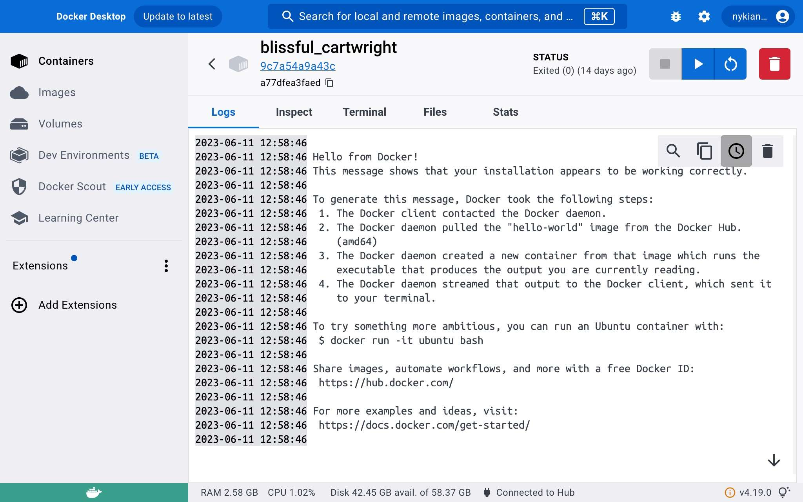

---  
type: TutorialClass  
title: 0.4-Docker-CLI  
description: In this Section, we will explore the Docker CLI. You will learn to  
  pull images from the DockerHub as well as build them with the use of a  
  Dockerfile. You will also learn how to run and start containers from the  
  command line.  
share: true  
category: 0-Getting-Started  
created: Friday, June 9th 2023, 12:11:57 am  
modified: Friday, July 7th 2023, 2:07:39 pm  
tags:  
  - shapecreations  
  - docker  
  - containers  
  - images  
  - cli  
  - module-0  
media: '["!(Tutorial/media/official-image-badge-iso.png)","!(Tutorial/media/docker-desktop-image-view.jpeg)",  
  "!(Tutorial/media/docker-desktop-container-view.jpeg)","!(docker-desktop-image-layer-view.png)"]'  
status: complete  
---  
  
  
---  
  
# 0.4-Docker-CLI  
  
  
  
---  
  
## Overview  
  
We will now get to brass tax and start working with our newly installed Docker Engine. This section will continue to expand on our Docker knowledge-base with a few more necessary concepts and tools that will make our lives a whole lot easier. But as is usually the way, we must push through the tedious method before we can appreciate the *shortcuts*.  
  
> ⚠ Warning!    
> Do not skip through this section. This Section, more than any of its predecessors, will be interlaced with tips and caveats, without which you will almost certainly have difficulty when we start developing Shape Creations.  
>  
> Docker is not perfect but it is a machine. In all its complexity, it has a simple set of underlying rules that govern its behavior. If you learn the rules, you can better manipulate it to achieve your goals. But enough serious talk though, let’s get to it!  
  
## Forget Something?  
  
As we start to pile on the Docker CLI commands, you may experience a harmless case of Docker amnesia. The Docker CLI has an extensive web of commands, the vast majority of which you will never need to use. Thankfully, if you’re ever in doubt, you can append the `--help` flag to the end of any command. Docker will output a detailed list of acceptable options and commands that are related to what you already entered.  
  
```shell  
$ docker --help  
```  
  
OR  
  
```shell  
$ docker logs --help  
```  
  
## Testing Our Installation with `hello-world`  
  
Time for the obligatory Hello-World demo. We will use the simple pre-built image and run the `Hell-World` container from the Docker CLI. The container itself doesn’t do much but print a welcome message and explain the Docker process. We will be using it to practice a couple commands which should become a part of your Docker routine quickly.  
  
### Images  
  
If you recall, Docker images are built using base images found in a repository called [DockerHub](https://hub.docker.com/) which can be appended with our personal configuration using something called a `Dockerfile`. All but one of our services will require its own `Dockerfile` so we will need to tackle this soon.  
  
For now, let’s test out our Docker installment with a simple `hello-world` image.  
  
> ⚠ Warning!    
> Remember how I said when you create a free account you can host unlimited public images and only one private image? Well, imagine that anyone can make an account and anyone can host unlimited public images; without any review!  
>  
> Images on the DockerHub site are not to be trusted unless they have a Docker Official Image banner.[^1] Thankfully, the good old boys at Docker introduced some order to the chaos. Any image with the badge shown below has undergone a rigorous proposal process that checked its contents for malicious code, an unnecessarily large footprint, and that it does what it says it does.  
>  
>   
  
#### The `docker pull` Command  
  
If you don’t require a dedicated `Dockerfile` and have found a suitable and verified image from DockerHub, you can use the command `docker pull IMAGE_NAME:VERSION` command to *pull* a local version of that image onto your local Docker Desktop instance.  
  
> ✏ Note:    
> If you don’t specify a version when pulling an image, the command will default to `latest`. This is fine for the purposes of this demo, but it is best practice to be as specific as possible when building an image. Since an image must contain all the dependencies and binaries necessary to run your application, slight variances between versions can cause unforeseen errors.  
  
At your command line prompt issue the following command :  
  
```shell  
$ docker pull hello-world  
```  
  
<details>  
	<summary>Expected Output</summary>  
  
```shell  
Using default tag: latest  
latest: Pulling from library/hello-world  
719385e32844: Pull complete  
Digest: sha256:fc6cf906cbfa013e80938cdf0bb199fbdbb86d6e3e013783e5a766f50f5dbce0  
Status: Downloaded newer image for hello-world:latest  
docker.io/library/hello-world:latest   
```  
  
</details>  
  
#### Inspecting Images  
  
There are two ways to view your built images: (1) via the Docker Desktop GUI or (2) through the CLI (preferred). When we get into a routine of building and rebuilding images, checking your images will need to become quicker than pulling up the GUI. Force yourself to type out (or use the auto-completion feature in defined in your command line Shell profile.) these commands. It takes a little bit, but muscle memory will soon take over.  
  
##### **(1) Docker Desktop GUI**  
  
To view all images currently built in Docker Desktop just navigate to the `Images` tab on the left menu. Here you will see the image name, tag, status, time created, and size. You may also delete an image from this view.  
  
- **Name** : The image name consists of the Docker Hub repository and the name given during the build. If unspecified, the image will be given an alphanumeric unique identifier. You will need to use either the given name or the unique identifier to refer to an image when starting a container.    
- **Tag** : The tag is the version and or *flavor* that is being built. If no version information is provided, the default tag will be `latest`. It is always best to specify a version when building images, as this can prevent unforeseen errors if things become deprecated or otherwise changed from version to version.  
- **Status** : The status denotes whether or not the image is currently being used in any containers.  
- **Created** : The created column tracks when the image was built. Check this to be sure you are using the most recently built image.  
  
    
  
You can also inspect the image’s layers by clicking on an image name. This view shows you each command from the dockerfile, which if you recall, starts a new layer. This can be very useful but is beyond the scope of this tutorial.  
  
  
  
##### **(2.) Docker CLI** (preferred method)  
  
The preferred method in this tutorial will of course be the `docker` command. There is a bit less information but you usually only need what is given in this command:  
  
- **Repository** : The name of the repository that the base image was pulled from.  
- **Tag** : This is the version tag.  
- **Image ID** : The `Image ID` is the same as the name or unique identifier found in the Docker Desktop view.  
- **Created** : The build time of the image.  
- **Size** : The size of the image. The aim is to have as small of a footprint as possible by intelligently orchestrating the layers. We will discuss this in brief later, but for now it is just some metadata.  
  
```shell  
$ docker image ls  
```  
  
<details>  
	<summary>Expected Output</summary>  
  
```shell  
REPOSITORY    TAG       IMAGE ID       CREATED       SIZE  
hello-world   latest    9c7a54a9a43c   5 weeks ago   13.3kB  
```  
  
</details>  
  
To inspect each layer of Docker image, you simply use the command `docker image histroy {image_id}`.  
  
```shell  
$ docker image history 9c7a54a9a43c  
```  
  
<details>  
	<summary>Expected Output</summary>  
  
```shell  
IMAGE          CREATED        CREATED BY                                      SIZE      COMMENT  
9c7a54a9a43c   2 months ago   /bin/sh -c #(nop)  CMD ["/hello"]               0B  
missing      2 months ago   /bin/sh -c #(nop) COPY file:201f8f1849e89d53…   13.3kB  
```  
  
</details>  
  
### Containers  
  
Now that our image is built, we will attempt to start or *run* a container based on it.  
  
#### The `docker run` Command  
  
Using the `IMAGE_ID` from the output of the previous command, you can run a container based on the `Hello-World` image we just pulled as follows :  
  
```shell  
$ docker run 9c7a54a9a43c  
```  
  
<details>  
	<summary>Expected Output</summary>  
  
```shell  
Hello from Docker!  
This message shows that your installation appears to be working correctly.  
  
To generate this message, Docker took the following steps:  
 1. The Docker client contacted the Docker daemon.  
 2. The Docker daemon pulled the "hello-world" image from the Docker Hub.  
    (amd64)  
 3. The Docker daemon created a new container from that image which runs the  
    executable that produces the output you are currently reading.  
 4. The Docker daemon streamed that output to the Docker client, which sent it  
    to your terminal.  
  
To try something more ambitious, you can run an Ubuntu container with:  
 $ docker run -it ubuntu bash  
  
Share images, automate workflows, and more with a free Docker ID:  
 https://hub.docker.com/  
  
For more examples and ideas, visit:  
 https://docs.docker.com/get-started/  
```  
  
</details>  
  
#### Inspecting Containers  
  
Just as we had two views for successfully built images, there are two ways to inspect containers. There is a lot more useful information about containers than images. We will take a few minutes to explore containers in the Docker Desktop GUI as well as their complimentary `docker` commands.  
  
##### (1) Docker Desktop GUI  
  
  
  
If you click on a container, you can view logs, inspect it, use the terminal within the container, see any files that are associated with the container, and view the stats. You can also run, restart, and delete the container from this view.  
  
  
  
##### (2) Docker CLI (preferred method)  
  
Containers can do a great many things once started and not all of them continue to run after their initial start. The `hello-world` image will run such a container. It’s only purpose at run time is to display a message and then the container stops. For such a case, we will need to inspect using the `-a` flag. But most containers can be expected to persist in their running state. To view running containers only, use the following command :  
  
```shell  
$ docker ps  
```  
  
<details>  
	<summary>Expected Output</summary>  
  
```shell  
CONTAINER ID   IMAGE     COMMAND   CREATED   STATUS    PORTS     NAMES  
```  
  
</details>  
  
> ⚠ Warning!    
> If a container was not started successfully or automatically stops after it completes its task, you will not see it using `docker ps`. Only actively running containers show up in this view. To view containers that are stopped use the command `docker ps -a` instead.    
  
```shell  
$ docker ps -a  
```  
  
<details>  
	<summary>Expected Output</summary>  
  
```shell  
CONTAINER ID   IMAGE          COMMAND    CREATED             STATUS                         PORTS     NAMES  
a77dfea3faed   9c7a54a9a43c   "/hello"   About an hour ago   Exited (0) About an hour ago             blissful_cartwright  
```  
  
</details>  
  
If you want to inspect the container from command line, you get a lot more information than if you use the GUI alone. Try the next command using the `container id` from the previous output and get to know some of the details about our container.  
  
```shell  
$ docker container inspect a77dfea3faed  
```  
  
You can also view logs in the CLI using the simple command below. For our `hello world` container, this simply shows the message that it output but using `logs` is usually the best way to view errors and potential misconfiguration of a container. You will want to get into the habit of viewing your container logs in this way. It’s quicker than the GUI by far.  
  
```shell  
$ docker logs a77dfea3faed  
```  
  
#### Naming Containers  
  
Besides using the `container id` every time you want information on a container, you can also use the `container name`. Docker will automatically name containers. You can run all the aforementioned commands using the random name generated. For this container, the name is `blissful_cartwright`.  
  
```shell  
$ docker logs blissful_cartwright  
```  
  
While running `docker ps` to find the `container id` or `container name` isn’t too cumbersome, we can make our lives easier by setting our own name. Let’s try the `Hello World` example again, but this time with our own name.  
  
```shell  
$ docker run --name hello-world 9c7a54a9a43c  
```  
  
Now when we want to reference our container we can use the identifier `hello-world`. We can see this change when we run `docker ps -a`. We now see two containers using the same image.  
  
```shell  
$ docker ps -a   
```  
  
<details>  
	<summary>Expected Output</summary>  
  
```shell  
CONTAINER ID   IMAGE          COMMAND    CREATED         STATUS                     PORTS     NAMES  
393eaf5d5a37   9c7a54a9a43c   "/hello"   8 seconds ago   Exited (0) 6 seconds ago             hello-world  
a77dfea3faed   9c7a54a9a43c   "/hello"   2 weeks ago     Exited (0) 2 weeks ago               blissful_cartwright  
```  
  
</details>  
  
Try running some of the other commands using the new container’s name. It will be much easier to remember our own names for containers though we will make things even easier using Docker Compose.  
  
```shell  
$ docker logs hello-world  
```  
  
> 🔮 Crystal Ball    
> We can also “name” our images, but this is called tagging and will be covered when we talk about using `Dockerfiles` to build images.  
  
---  
  
## Resources  
  
- Scwarzmüller, M. (2023). Docker & Kubernetes: The Practical Guide [MOOC]. <https://www.udemy.com/share/103Ia0/>  
  
---  
  
## Footnotes  
  
[^1]: [Docker Official Images | Docker Documentation](https://docs.docker.com/docker-hub/official_images/)  
